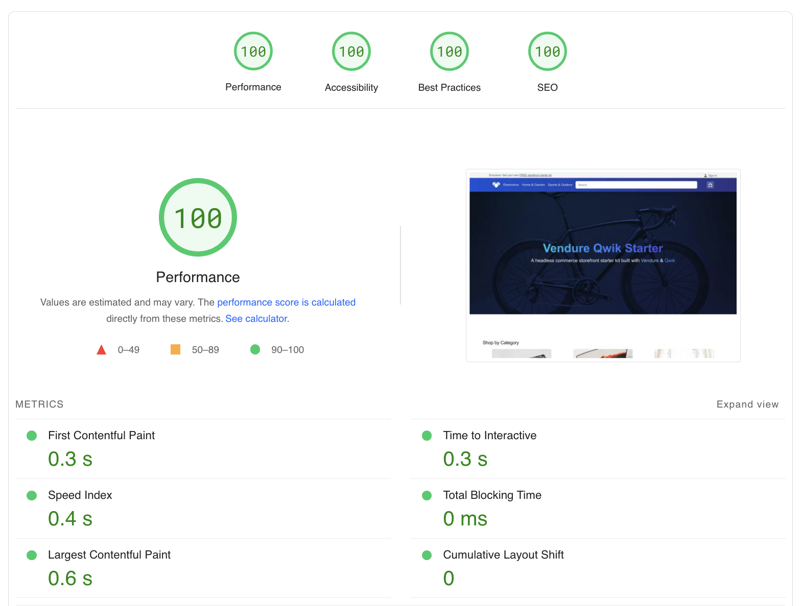

# Vendure Qwik Storefront Starter️

An e-commerce storefront for [Vendure](https://www.vendure.io) built with [Qwik](https://qwik.builder.io/) & [Qwik City](https://qwik.builder.io/qwikcity/overview).

👉 [qwik-storefront.vendure.io](https://qwik-storefront.vendure.io)

## Core Web Vitals

<br/>



<br/>

### 📑 [Guide: Spin up an e-commerce app in 60s with Vendure + Qwik](https://dev.to/prasmalla/in-2023-set-up-a-nodejs-e-commerce-app-in-1-minute-with-vendure-qwik-bl7)

## Features

- Cart ✅
- Checkout flow ✅
- Search facet filters ✅
- Login ✅
- Account creation ✅
- Customer account management ✅
- SPA-mode navigation ✅
- Set up GraphQL code generation ✅

**Contributions welcome!**

## Frequently Asked Questions

- [Can I deploy the application in different environment (e.g Netlify, Fastify, etc. etc)?](#can-i-host-the-application-in-my-environment-or-is-limited-to-cloudflare)
- [Why can I not reach my remote server?](#why-can-i-not-reach-my-remote-server)
- [Why does signup or login not work?](#why-does-signup-or-login-not-work)
- [What payment systems are supported?](#what-payment-systems-are-supported)

### Can I host the application in my environment or is limited to Cloudflare?

We are using Cloudflare, but there isn't a specific Cloudflare feature for this application.
If you want to deploy your application in a different environment, you can follow the [Qwik guide](https://qwik.builder.io/docs/deployments/#add-an-adapter) and customize the code base according to your needs.

### Why can I not reach my remote server?

When running the storefront make sure when in dev mode (ie: using vite) to attach it to the network by using `--host 0.0.0.0`
For example: `"start": "vite --open --mode ssr --port 80 --host 0.0.0.0",`

Also make sure your firewall allows traffic on your selected port.
For Ubuntu: `sudo ufw status` to see what is blocked or allowed.

### Why does signup or login not work?

https needs to be enabled, please confirm you are using ssl. You can use apache or nginx to forward ssl traffic to your selected port.

Make sure that your vendure instance is accessible and not being blocked by a firewall for example.

If you see a message on signup "Account registration is not supported by the demo Vendure instance. In order to use it, please connect to your own local / production instance." This is simply a static message, it is not doing any actual check. Simply remove this message. To connect to your vendure instance simply set the .env variables to point to your vendure setup.

### What payment systems are supported?

Currently Braintree and Stripe are supported on the frontend, but not currently Mollie.
For Braintree make sure to name your payment method in your vendure admin "braintree payment" and specifically code "braintree-payment".

## Development

Development mode uses [Vite's development server](https://vitejs.dev/). During development, the `dev` command will server-side render (SSR) the output.

```shell
pnpm start
```

> Note: during dev mode, Vite may request a significant number of `.js` files. This does not represent a Qwik production build.

## Preview

The preview command will create a production build of the client modules, a production build of `src/entry.preview.tsx`, and run a local server. The preview server is only for convenience to locally preview a production build, and it should not be used as a production server.

```shell
pnpm preview # or `yarn preview`
```

## Production

The production build will generate client and server modules by running both client and server build commands. Additionally, the build command will use Typescript to run a type check on the source code.

```shell
pnpm build # or `yarn build`
```

## i18n

### Marking string for translation

Any string can be marked for translation by using the `$localize` template function like so:

```typescript
export default component$((props: { name: string }) => {
	return <span>{$localize`Hello ${props.name}!`}</span>;
});
```

### Extracting string for translation

The first step in translation is to build the application. Once the artifacts are build the strings can be extracted for translation.

```bash
pnpm build.client
pnpm i18n-extract
```

The result of the commands is `src/locale/message.en.json`.

### Translating strings

Take the resulting string and send them for translation. Produce a file for each language. For example:

```bash
src/locale/message.en.json    # Original strings
src/locale/message.es.json
```

### Sorting translations

Qwik hashes bundles based on the content of the files. This means that if a file changes, the order of i18n translations will be lost and can be difficult to manage manually.

```bash
pnpm i18n-sort
```

The `i18n-sort` script will sort by first appearance in the src folder to keep a consistent order.

### Testing translations

The resulting language should match your browser language. You can also override the language by adding ?lang=es to the URL.

---

## Related

- [Vendure Docs](https://vendure.io/docs)
- [Vendure Github](https://github.com/vendure-ecommerce/vendure)
- [Vendure Discord](https://vendure.io/community)
- [Qwik Docs](https://qwik.builder.io/)
- [Qwik Github](https://github.com/BuilderIO/qwik)
- [@QwikDev](https://twitter.com/QwikDev)
- [Qwik Discord](https://qwik.builder.io/chat)
